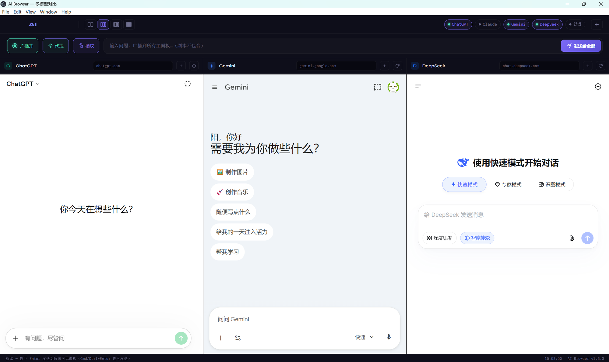

# 🤖 AI Browser — 智能多模态对比平台

<p align="center">
  
</p>

**AI Browser** 是一款专为 AI 模型评估与对比设计的智能桌面浏览器。基于 Electron 构建，支持在统一界面内同时运行 ChatGPT、Claude、Gemini、DeepSeek、智谱清言等主流大模型，通过一键广播提问与实时横向对比，帮助用户高效评估不同 AI 模型的表现差异。

## ✨ 亮点功能

| 功能 | 说明 |
|------|------|
| 📡 **一键广播** | 输入问题，按 Enter 自动注入到所有可见 AI 面板，同时触发发送 |
| 🖥️ **多栏布局** | 支持 2 / 3 / 4 / 5 栏自由切换，拖拽分隔线调整宽度 |
| 👥 **多账号副本** | 每个 AI 面板可克隆副本，独立 session 互不干扰 |
| 🔐 **指纹伪装** | 伪造 WebGL / Canvas / AudioContext / WebRTC 指纹，防 AI 网站风控 |
| 🌐 **代理支持** | 内置 HTTP / HTTPS / SOCKS4 / SOCKS5 代理，独立配置 |
| 💾 **登录持久化** | 关闭重启无需重新登录，状态自动保存 |

## 🌍 支持的 AI 模型

| 模型 | 网址 | 状态 |
|------|------|:--:|
| ChatGPT | chatgpt.com | ✅ |
| Claude | claude.ai | ✅ |
| Gemini | gemini.google.com | ✅ |
| DeepSeek | chat.deepseek.com | ✅ |
| 智谱清言 | chatglm.cn | ✅ |

## ⌨️ 操作方式

- **Enter** — 发送问题到所有可见面板
- **Ctrl+Enter** / **Cmd+Enter** — 同上
- **点击状态栏标签** — 单独开关某个 AI 面板
- **拖动分隔线** — 调整面板宽度
- **广播开关** — 开启/关闭统一广播模式
- **+ 按钮** — 新增任意 AI 的独立副本

## 🚀 快速开始

```bash
# 安装依赖
npm install

# 启动开发
npm start
```

## 📦 打包发布

```bash
npm run dist:win      # Windows (.exe NSIS 安装包)
npm run dist:mac      # macOS (.dmg)
npm run dist:linux    # Linux (.AppImage)
npm run dist:all      # 三端同时打包
```

## 🛠 技术栈

- **Electron 28** — 桌面框架
- **Chromium webview** — 内嵌 AI 网站
- **Node.js 18+** — 主进程

## 📂 项目结构

```
src/
├── main.js              # Electron 主进程
├── index.html           # 主界面
├── css/main.css         # 样式（暗色主题）
└── js/
    ├── ai-types.js      # AI 模型定义与注入逻辑
    ├── app.js           # 应用入口
    ├── broadcast.js     # 广播引擎
    ├── panels.js        # 面板管理（布局/克隆/显隐）
    ├── proxy.js         # 代理模块
    ├── fingerprint-core.js   # 指纹伪装（注入 webview）
    ├── fingerprint-ui.js     # 指纹设置界面
    ├── webview.js       # webview 生命周期
    ├── state.js         # 状态持久化
    ├── clock.js         # 状态栏时钟
    └── toast.js         # Toast 通知
```

## 🏗 开发规范

使用 Trellis + OpenSpec 进行规格驱动开发（SDD）：

- `docs/plan.md` — 主实施计划
- `docs/outcomes/` — 验收标准
- `docs/architecture/` — 架构文档

## 📄 License

MIT
