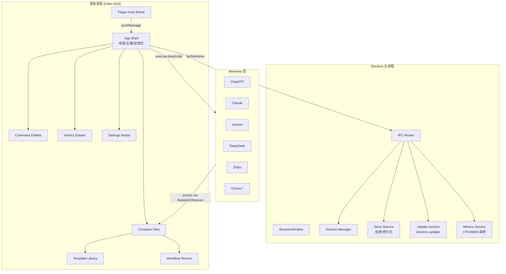

# AI Browser 新需求技术设计 — Claude Opus 4.7

| 项目 | 内容 |
| --- | --- |
| 文档版本 | v0.1（草案） |
| 创建日期 | 2026-05-13 |
| 文档作者 | Claude Opus 4.7（方案设计） |
| 配套需求 | 同目录 `requirements.md` |
| 基线代码 | v1.4.1（`src/` 目录） |
| 文档状态 | 待评审 |

> 本文档给出 How：架构、模块划分、数据模型、关键算法、目录调整与里程碑落地步骤。

---

## 1. 设计原则

1. **渐进式**：不做一次性大重构，所有新模块以 ES module 独立加入 `src/js/`，可分阶段灰度开启。
2. **主进程优先**：涉及加密、文件、网络、凭据的操作一律放主进程，渲染进程仅消费。
3. **克制动画**：所有动画 ≤ 250 ms 并遵循 `prefers-reduced-motion`。
4. **零登录泄露**：任何新特性不得修改既有的 `persist:aisession` 与 `persist:clone-*` 分区行为。
5. **AI 无关的抽象**：每个 AI 网站能力（inject / extract / selectors）收敛在 `ai-types.js` 里，其他模块不感知具体 AI。
6. **可测试**：新增模块以纯函数为主，与 DOM 交互通过适配器隔离。

## 2. 总体架构



## 3. 目录与模块划分

### 3.1 现有结构回顾

```
src/
├── main.js
├── index.html
├── css/main.css
└── js/
    ├── ai-types.js
    ├── app.js
    ├── broadcast.js
    ├── clock.js
    ├── fingerprint-core.js
    ├── fingerprint-profiles.js
    ├── fingerprint-ui.js
    ├── panels.js
    ├── proxy.js
    ├── state.js
    ├── toast.js
    └── webview.js
```

### 3.2 目标结构

```
src/
├── main/
│   ├── main.js                # 原 main.js 迁入
│   ├── ipc.js                 # IPC 路由
│   ├── store.js               # 加密持久化（safeStorage + 文件）
│   ├── metrics.js             # CPU/MEM 采样
│   ├── updater.js             # electron-updater 封装
│   └── backup.js              # 备份与恢复
├── css/
│   ├── tokens.css             # 设计令牌（新增）
│   ├── theme-light.css        # 亮主题（新增）
│   ├── theme-dark.css         # 暗主题（重构自 main.css）
│   └── main.css               # 仅保留布局/组件，不再写颜色值
├── js/
│   ├── ai-types.js            # 扩展 extract()
│   ├── app.js
│   ├── broadcast.js           # 支持 @mention、模板
│   ├── panels.js              # 支持懒加载、休眠
│   ├── webview.js             # 监听 render-process-gone
│   ├── state.js
│   ├── toast.js
│   ├── clock.js
│   ├── proxy.js
│   ├── fingerprint-core.js
│   ├── fingerprint-profiles.js
│   ├── fingerprint-ui.js
│   ├── theme.js               # 主题切换（新增）
│   ├── shortcuts.js           # 快捷键注册（新增）
│   ├── command-palette.js     # Ctrl+K 面板（新增）
│   ├── history-store.js       # 与主进程 store 通信（新增）
│   ├── history-drawer.js      # 历史抽屉 UI（新增）
│   ├── compare-view.js        # 对比视图（新增）
│   ├── diff.js                # Diff 算法封装（新增）
│   ├── templates.js           # 模板库（新增）
│   ├── workflow.js            # 工作流引擎（新增）
│   ├── plugin-host.js         # 插件沙箱宿主（新增）
│   ├── export.js              # Markdown/PDF/PNG 导出（新增）
│   ├── metrics-view.js        # 状态栏资源显示（新增）
│   └── i18n.js                # 国际化（新增）
└── i18n/
    ├── zh-CN.json
    └── en-US.json
```

> 迁移策略：第 M1 里程碑完成主进程分离与 CSS 令牌化；后续模块按里程碑增量加入。

## 4. UI 设计系统

### 4.1 设计令牌（tokens.css 摘录）

```css
:root[data-theme="dark"] {
  --color-bg: #0e0f14;
  --color-bg-elev: #16181f;
  --color-surface: #1d2029;
  --color-border: #2a2e3a;
  --color-text: #e6e8ef;
  --color-text-dim: #9ba0ae;
  --color-accent: #7c6af7;
  --color-accent-2: #52d1a4;
  --color-danger: #ff6b6b;

  --radius-sm: 6px;
  --radius-md: 10px;
  --radius-lg: 14px;

  --shadow-1: 0 1px 2px rgba(0,0,0,.25);
  --shadow-2: 0 8px 24px rgba(0,0,0,.35);

  --space-1: 4px;  --space-2: 8px;  --space-3: 12px;
  --space-4: 16px; --space-5: 24px; --space-6: 32px;

  --motion-fast: 120ms;
  --motion-base: 200ms;
  --motion-slow: 320ms;
  --easing: cubic-bezier(.2,.8,.2,1);

  --font-sans: "Inter", "HarmonyOS Sans SC", system-ui, sans-serif;
  --font-mono: "JetBrains Mono", ui-monospace, Consolas, monospace;
}

:root[data-theme="light"] {
  --color-bg: #f7f8fb;
  --color-bg-elev: #ffffff;
  --color-surface: #ffffff;
  --color-border: #e5e7ef;
  --color-text: #1a1d24;
  --color-text-dim: #5b6272;
  --color-accent: #6750e4;
  --color-accent-2: #2aa988;
  --color-danger: #d0342c;
}

:root[data-theme="hc"] { /* 高对比 */
  --color-bg: #000; --color-text: #fff; --color-accent: #ffd400; --color-border: #fff;
}

@media (prefers-reduced-motion: reduce) {
  :root { --motion-fast: 0ms; --motion-base: 0ms; --motion-slow: 0ms; }
}
```

### 4.2 主题切换策略

- `theme.js` 暴露 `setTheme('light'|'dark'|'system'|'hc')`。
- `system` 档通过 `window.matchMedia('(prefers-color-scheme: dark)')` 监听变化。
- 主题值持久化到设置，启动时尽早应用以避免 FOUC（放在 `<head>` 内联脚本里读取）。
- Webview 内部网站主题不做干预（避免破坏网页登录态与 A/B 实验）。

### 4.3 组件规范

| 组件 | 规范要点 |
| --- | --- |
| Button | 主 `--color-accent`、次 `--color-surface`、危险 `--color-danger`；焦点环 2px 外描边 |
| Input | `--radius-md`；未聚焦 `--color-border`；聚焦 `--color-accent` |
| Modal | `--shadow-2`；最大宽 560 px；背景使用半透明 + `backdrop-filter: blur(12px)` |
| Toast | 顶部居中，最多同时 3 条，2.5s 自动收起 |
| Skeleton | 矩形骨架 + 渐变流光 1.4s |
| DiffBlock | 三列布局（左/右/统一），增行 `rgba(46,160,67,.18)`、删行 `rgba(248,81,73,.18)` |
| CommandPalette | 宽 640 px，居中偏上；支持「>操作」「@AI」「#模板」三种前缀路由 |

### 4.4 布局

- 基础栅格：`#panels-container` 采用 flex，最小面板宽度 320 px。
- 响应式：
  - `@media (max-width: 960px)`：主面板最多 2 栏，其它自动折叠。
  - `@media (max-width: 640px)`：降为单栏并启用横向滑动查看。
- 状态栏 pill 溢出时包裹容器改为 `overflow-x: auto`，滚动条隐藏。

## 5. 数据模型

### 5.1 会话（conversations）

```ts
type Conversation = {
  id: string;                 // uuid
  paneId: string;             // 主面板 type 或副本 id（例：chatgpt / claude-2）
  aiType: AiType;             // chatgpt | claude | gemini | deepseek | zhipu
  createdAt: number;
  updatedAt: number;
  tags: string[];
  favorite: boolean;
  rating?: 1|2|3|4|5;
  messages: Array<{
    role: 'user' | 'assistant' | 'system';
    content: string;
    ts: number;
    source?: 'broadcast' | 'manual' | 'workflow' | 'summary';
  }>;
};
```

### 5.2 对比记录（comparisons）

```ts
type Comparison = {
  id: string;
  question: string;
  createdAt: number;
  entries: Array<{
    paneId: string;
    aiType: AiType;
    conversationId: string;
    latencyMs: number;
    answer: string;
    rating?: 1|2|3|4|5;
  }>;
  summary?: { aiType: AiType; content: string };
};
```

### 5.3 模板（templates）

```ts
type Template = {
  id: string;
  name: string;
  category: string;           // 翻译 / 代码 / 写作 / 学习 / 自定义
  target: AiType | 'all';
  body: string;               // 含 {{var}} 占位
  variables: Array<{ key: string; label: string; default?: string }>;
  isBuiltin: boolean;
};
```

### 5.4 设置（settings）

```ts
type Settings = {
  theme: 'light' | 'dark' | 'system' | 'hc';
  locale: 'zh-CN' | 'en-US';
  shortcuts: Record<string, string>;  // commandId -> accelerator
  metrics: { enabled: boolean; intervalMs: number };
  sleep:   { enabled: boolean; idleMinutes: number };
  backup:  { enabled: boolean; retainDays: number };
  webdav?: { url: string; user: string; passEncrypted: string };
  plugins: Array<{ id: string; enabled: boolean; grants: string[] }>;
};
```

### 5.5 存储位置

- 根目录：`app.getPath('userData') + '/db/'`
- 文件：
  - `conversations.enc.json` — safeStorage 加密；
  - `comparisons.enc.json`；
  - `templates.json`（内置 + 用户自定义，非敏感，不加密）；
  - `settings.json`（敏感字段单独加密，如 webdav.passEncrypted）；
  - `backups/YYYYMMDD-HHmm.zip`。
- 规模上升到 ≥ 5 万条会话时再考虑切换到 `better-sqlite3`，本期不引入。

## 6. 关键技术方案

### 6.1 响应抓取（FR-C01）

- 在 `ai-types.js` 为每个 AI 扩展 `extract(webview): Promise<string>`，核心思路：
  - 以 `MutationObserver` 监听 AI 响应区域（如 ChatGPT 的 `div[data-message-author-role="assistant"]`），稳定 1.2 s 后判定为完成；
  - 取最后一条 assistant 的 `innerText`；
  - 超时 60 s 兜底，返回空串并上报 telemetry。
- 抓取发起时机：`broadcast.js` 发送注入后立即订阅各 webview 的抓取 Promise；结果写入 `comparisons` 并推送 `compare-view`。
- 失败降级：保留现有「复制到剪贴板」提示；抓取失败不影响发送成功状态。

### 6.2 Diff 渲染（FR-C02）

- 选用 `diff-match-patch`（MIT, ~40 KB），打包内引入。
- 粒度：默认按句子（`/[。！？!?.]\s+/` 切分），用户可切换为词级。
- 渲染：虚拟列表（1000+ 行时性能保障）。

### 6.3 一键汇总（FR-C03）

- Prompt 模板（可通过模板库覆盖）：
  ```
  你是严谨的评审员。原问题如下：
  {{question}}
  下面是 N 个模型的回答，请综合，给出：
  1) 共识；2) 关键分歧；3) 最佳整合答案。
  ---
  [ChatGPT]\n{{answers.chatgpt}}
  [Claude]\n{{answers.claude}}
  ...
  ```
- 发送目标为用户选定的汇总者 AI；生成的结果回写到 `comparisons.summary`。

### 6.4 工作流引擎（FR-C05）

- 节点定义（JSON，而非 YAML 以避免解析器依赖）：
  ```json
  {
    "id": "wf-outline-expand",
    "nodes": [
      { "id": "n1", "ai": "chatgpt", "template": "tpl-outline", "inputs": ["question"] },
      { "id": "n2", "ai": "claude", "template": "tpl-expand", "inputs": ["n1.output"] }
    ],
    "edges": [ { "from": "n1", "to": "n2" } ]
  }
  ```
- 运行器串行或并行调度节点，每步等待 `extract()` 返回后再送下一节点；支持失败重试与中止。

### 6.5 插件沙箱（FR-E01）

- 每个插件运行在独立 `<iframe sandbox="allow-scripts">`，不可访问 `window.top`；
- 主应用暴露受限 API（`window.parent.postMessage({ type, payload })`）：
  - `readHistory(filter)`
  - `broadcast(text, targets)`
  - `openUrlInPane(aiType, url)`
  - `showToast(msg)`
- 权限清单在 `manifest.json` 中声明，启用时弹窗让用户授予；运行期超权调用一律拒绝并计入日志。

### 6.6 命令面板（FR-E09）

- `command-palette.js` 维护命令注册表 `{ id, title, shortcut?, run, when? }`；
- 使用 Fuse.js（~20 KB）进行模糊匹配（标题 + 关键词 + 同义词）；
- 前缀路由：`>` 动作、`@` AI 面板、`#` 模板、`/` 会话历史。

### 6.7 Webview 懒加载与休眠（FR-E02）

- 首次启动将不在默认布局内的主面板 `src` 延迟到用户首次显示；
- `panels.js` 监听显隐时间戳，`sleep.idleMinutes` 后调用 `loadURL('about:blank')` 并记录 `lastUrl`；
- 再次可见时恢复；恢复前显示骨架屏。

### 6.8 崩溃恢复（FR-E04）

- 主进程监听每个 webview 的 `render-process-gone` 事件；
- 最近一次广播问题缓存于主进程 `lastQuery`，有效期 10 分钟；
- 渲染端收到主进程 `pane-crashed` IPC 后显示 Toast，带「重载并继续」按钮，点击后 `reload()` 并在加载完成后自动注入 `lastQuery`。

### 6.9 加密存储（FR-D03）

- 方案 A：`safeStorage.encryptString` / `decryptString`（可用性依赖平台 keyring）。
- 方案 B（Linux 无 keyring 时）：用户密码派生 AES-256-GCM 密钥（`scrypt`, N=2^15），首次启动设置保护密码。
- 实际执行：主进程根据 `safeStorage.isEncryptionAvailable()` 自动选择；渲染端只看到解密后的对象。

### 6.10 主进程 IPC（节选）

```ts
// src/main/ipc.js
ipcMain.handle('history:list',     (e, filter) => store.listConversations(filter));
ipcMain.handle('history:save',     (e, conv)   => store.upsertConversation(conv));
ipcMain.handle('history:search',   (e, q)      => store.searchFullText(q));
ipcMain.handle('compare:save',     (e, c)      => store.saveComparison(c));
ipcMain.handle('settings:get',     ()          => store.getSettings());
ipcMain.handle('settings:set',     (e, p)      => store.setSettings(p));
ipcMain.handle('export:md',        (e, p)      => exporter.toMarkdown(p));
ipcMain.handle('export:pdf',       (e, p)      => exporter.toPdf(p));
ipcMain.handle('metrics:sample',   ()          => metrics.sampleOnce());
ipcMain.handle('backup:create',    ()          => backup.create());
ipcMain.handle('backup:restore',   (e, id)     => backup.restore(id));
ipcMain.on    ('pane-crashed',     (e, paneId) => /* 广播给渲染端 */);
```

## 7. 安全与隐私

| 风险 | 缓解 |
| --- | --- |
| 历史明文落盘 | 主进程 `safeStorage`/AES-GCM；渲染端仅接收解密副本 |
| 插件越权 | 沙箱 iframe + 白名单 API + 权限声明弹窗 |
| 自动更新被劫持 | 仅信任 GitHub Releases 签名产物；更新通道可关闭 |
| 日志泄露 cookie | 日志导出前统一走 `sanitize()` 过滤 Set-Cookie、Authorization |
| 远程内容注入 | webview 仍保持 `contextIsolation=no`（现有架构），但新模块 IPC 强校验参数类型 |

## 8. 性能预算

| 指标 | 预算 | 验证方式 |
| --- | --- | --- |
| 冷启动到可交互 | ≤ 3 s | 启动埋点 |
| 布局切换动画 | 200 ms | 手动 + Performance API |
| 命令面板首次出现 | ≤ 50 ms | Performance.mark |
| 历史搜索 10k 条 | ≤ 200 ms | Benchmark 脚本 |
| 5 面板内存稳态 | ≤ 1.2 GB | 主进程 metrics 采样 |
| Webview 休眠内存回收 | ≥ 30% | 采样对比 |

## 9. 依赖评估

| 依赖 | 用途 | 大小 | 风险 |
| --- | --- | --- | --- |
| diff-match-patch | Diff 渲染 | ~40 KB | 低 |
| fuse.js | 命令面板搜索 | ~20 KB | 低 |
| electron-updater | 自动更新 | 打包器提供 | 中（需配置 publish） |
| jszip | 导出 / 备份打包 | ~90 KB | 低 |
| markdown-it | Markdown 渲染与导出 | ~100 KB | 低 |
| （不引入）better-sqlite3 | 大规模历史 | — | 暂不引入，留作 M4 |
| （不引入）React/Vue | UI 框架 | — | 暂不引入，保留原生 DOM |

## 10. 迁移与落地步骤

### 10.1 M1 — 基础重塑（2 周）

1. 拆主进程：`src/main.js` → `src/main/`（main / ipc / store / metrics 占位）；保持入口兼容。
2. 抽令牌：把 `src/css/main.css` 中硬编码色值抽到 `tokens.css`；引入 `theme-light.css`；`main.css` 仅保留布局/组件。
3. 加 `theme.js` + 标题栏主题切换按钮；在 `<head>` 内联脚本中提前读设置避免 FOUC。
4. 加 `shortcuts.js` + `command-palette.js`；注册 ≥ 30 个命令。
5. 加 `history-store.js`（渲染端）+ `store.js`（主端）；先落只读历史面板。
6. `panels.js` 支持懒加载/休眠；`webview.js` 捕获 `render-process-gone`。
7. 新增设置 Modal（使用既有 Modal 样式，放在 `index.html` 末尾）。

### 10.2 M2 — 协作增强（3 周）

1. `ai-types.js` 每 AI 补 `extract()`；为各站点 assistant 选择器建立回归用例。
2. 实现 `compare-view.js` + `diff.js`；接入导出（`export.js`）。
3. 实现 `templates.js`（内置 15 条 + 自定义 CRUD）；在输入框侧提供模板按钮。
4. `broadcast.js` 支持 `@mention` 与模板变量替换。
5. 搜索、标签、收藏、备份。

### 10.3 M3 — 平台化（3 周）

1. `plugin-host.js` + 示例插件（Token 计数 / 划词翻译）。
2. `workflow.js`（先上两段式 DAG）。
3. `updater.js`、`metrics-view.js`、`i18n.js`、快捷键编辑器、诊断包导出、WebDAV 同步。

## 11. 测试策略

- **单元测试**：`diff.js`、`templates.js`、`workflow.js`、`store.js` 纯函数覆盖 ≥ 80%。
- **注入回归**：每个 AI 的 `inject` / `extract` 独立 fixture，DOM 变化时可快速定位。
- **冒烟用例**：启动、5 面板可见、广播、副本、代理切换、指纹切换、主题切换、崩溃重启、导出、搜索，均纳入 `docs/verification/outcome-checks.md`。
- **性能基线**：M1 结束后建立一次，后续每次发布前对比。

## 12. 风险与未决议题

| 风险 / 议题 | 说明 | 处理 |
| --- | --- | --- |
| AI 站点 DOM 变动 | 直接影响 inject/extract | 选择器配置化；单 AI 失败不阻塞整体广播 |
| `safeStorage` 在部分 Linux 发行版不可用 | 影响加密 | 降级为口令派生 AES-GCM |
| 插件安全 | iframe 也可能被利用 | API 白名单 + 权限弹窗 + 运行日志审计 |
| 自动更新签名 | Windows/macOS 公证 | 使用 GitHub Releases + provider=github，必要时补代码签名（后续） |
| 是否引入 React | 降低复杂 UI 成本 | 暂不；若 M3 后组件数量 > 40 再评估 |
| SQLite vs JSON | 大量历史的搜索性能 | 先 JSON + 倒排索引，超过 5w 条时切 SQLite |
| WebDAV vs 自建同步 | 数据主权 | WebDAV 最小实现优先 |

## 13. 与现有文档的关系

- 本文档仅定义新增/改造；原 `docs/architecture/system-overview.md` 在 M1 完成后补一次「模块拓扑」插图。
- 每个里程碑拆出的 outcome 文件落在 `docs/outcomes/outcome-XX-*.md`，命名与 FR 编号一一对应。
- 设计令牌与主题规范落地后，需更新 `docs/ui/design-system.md`。

---

> 评审通过后，按 M1 顺序先开 `tokens.css` 抽取与主进程拆分两个 PR，完成后再进入命令面板与历史模块。
